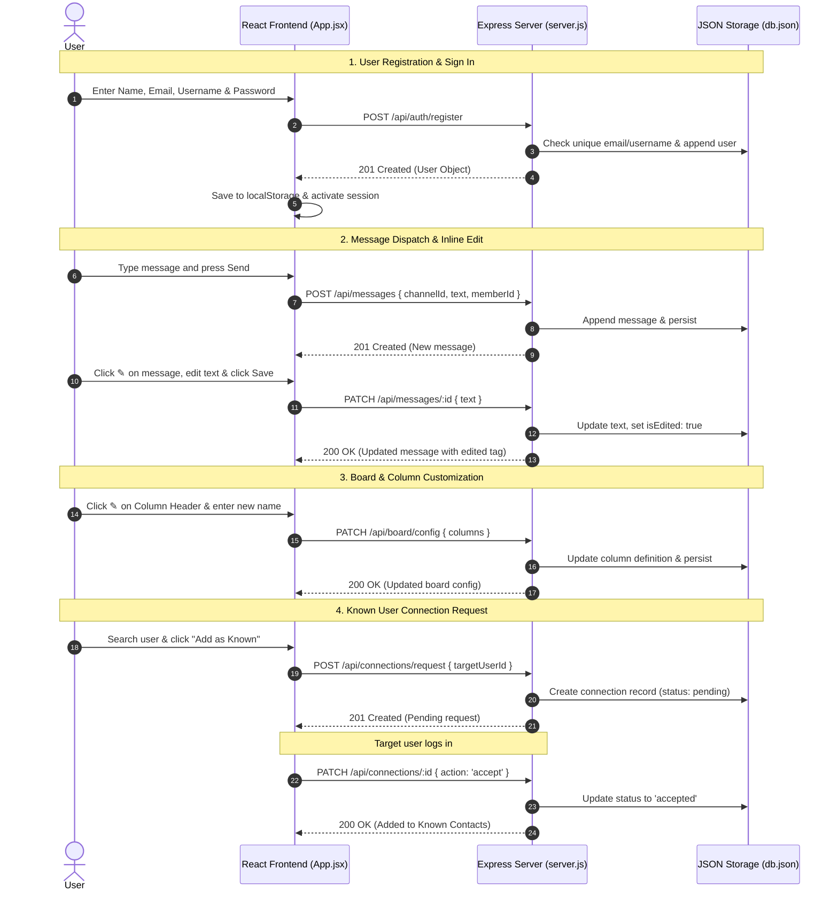

# 📖 Rosetta: Frontend & Backend Technical Architecture & Workflow

---

## 🌟 1. System Overview

**Rosetta** is an integrated developer workspace combining **real-time contextual messaging** and **agile Kanban sprint task management** into a unified, side-by-side dual-pane web application.

```
┌────────────────────────────────────────────────────────────────────────────────────────┐
│                                   ROSETTA WORKSPACE                                    │
├────────────────────────────────────────────────────────────────────────────────────────┤
│                               TOPBAR: Status & Viewport Controls                       │
├───────────────────────┬────────────────────────────────┬───────────────────────────────┤
│    LEFT DRAWER        │          LEFT PANE             │          RIGHT PANE           │
│  Channels & Contacts  │            MESSAGES            │             BOARD             │
│                       │                                │                               │
│  • # general          │  • Live Chat Stream            │  • [To Do] [In Progress]...   │
│  • # development      │  • Inline Message Editing      │  • Editable Column Names      │
│  • # deployments      │  • Channel Selector            │  • Task Movement (◀ / ▶)      │
│  • Known Contacts     │  • Message Dispatcher          │  • Priority Badges & Assignee │
└───────────────────────┴────────────────────────────────┴───────────────────────────────┘
```

---

## 🛠️ 2. Backend Architecture (`server.js`)

The backend is built on **Node.js** with **Express**, providing a lightweight, high-performance RESTful API and static asset server.

### 2.1 Storage & Data Persistence Layer
- **Engine:** JSON Flat-File Database with in-memory caching (`data/db.json`).
- **Initialization:** Automatically seeds default channels, members, sprint tasks, and board columns if no data directory exists.
- **Atomic Synchronization:** Every mutation (`POST`, `PATCH`, `DELETE`) immediately updates the in-memory object and synchronously persists the state to disk via `fs.writeFileSync`.

---

### 2.2 Data Schemas & Entities

#### A. User & Authentication (`db.users`)
```json
{
  "id": "u-1",
  "username": "tanjim",
  "name": "Tanjim Ahmed",
  "email": "tanjim@rosetta.local",
  "password": "password123",
  "role": "Lead Architect & Admin",
  "avatar": "https://api.dicebear.com/7.x/bottts/svg?seed=tanjim",
  "createdAt": "2026-08-08T12:00:00.000Z"
}
```

#### B. Known Connections Network (`db.connections`)
```json
{
  "id": "conn-1786202647000",
  "senderId": "u-1",
  "receiverId": "u-2",
  "status": "accepted",
  "createdAt": "2026-08-08T12:30:00.000Z"
}
```

#### C. Board Configuration & Columns (`db.boardConfig`)
```json
{
  "title": "Rosetta Sprint Board",
  "columns": [
    { "id": "todo", "name": "Backlog & To Do" },
    { "id": "in-progress", "name": "In Progress" },
    { "id": "review", "name": "Code Review" },
    { "id": "done", "name": "Completed" }
  ]
}
```

#### D. Sprint Task Cards (`db.cards`)
```json
{
  "id": "card-1",
  "title": "Implement dual-pane responsive layout",
  "description": "Ensure Messages and Board can sit side-by-side or expand.",
  "list": "todo",
  "priority": "urgent",
  "assignee": "Tanjim Ahmed",
  "createdAt": "2026-08-08T12:00:00.000Z"
}
```

#### E. Chat Messages (`db.messages`)
```json
{
  "id": "msg-1",
  "channelId": "c-1",
  "memberId": "u-1",
  "senderName": "Tanjim Ahmed",
  "text": "Starting the development sprint on Rosetta.",
  "isEdited": true,
  "timestamp": "2026-08-08T12:05:00.000Z",
  "updatedAt": "2026-08-08T12:10:00.000Z"
}
```

---

### 2.3 Backend REST API Endpoints Reference

| Category | Method | Endpoint | Description |
| :--- | :--- | :--- | :--- |
| **System** | `GET` | `/api/health` | Service uptime, CPU/memory telemetry, timestamp |
| | `GET` | `/api/stats` | Aggregate counts (messages, cards, members, users) |
| **Auth** | `POST` | `/api/auth/register` | Register new user with Name, Email, Username, Password, Role |
| | `POST` | `/api/auth/login` | Authenticate using Email OR Username + Password |
| | `GET` | `/api/auth/users` | List all registered users in directory |
| **Connections** | `GET` | `/api/connections` | Retrieve current user's known contacts & pending requests |
| | `POST` | `/api/connections/request` | Send "Add as Known" request to target user |
| | `PATCH` | `/api/connections/:id` | Accept or Decline a connection request |
| **Board** | `GET` | `/api/board/config` | Get current board title and customized column names |
| | `PATCH` | `/api/board/config` | Rename board title or column headers |
| | `GET` | `/api/cards` | Retrieve task cards (filterable by `?list=...`) |
| | `POST` | `/api/cards` | Create a new sprint task card |
| | `PATCH` | `/api/cards/:id` | Move card across columns or modify details |
| | `DELETE` | `/api/cards/:id` | Delete a task card |
| **Messages** | `GET` | `/api/channels` | List all chat channels |
| | `POST` | `/api/channels` | Create a new channel |
| | `GET` | `/api/messages` | Retrieve messages for a channel (`?channelId=...`) |
| | `POST` | `/api/messages` | Post a new message to a channel |
| | `PATCH` | `/api/messages/:id` | Edit/modify message text inline |
| | `DELETE` | `/api/messages/:id` | Delete a message |

---

## 💻 3. Frontend Architecture (`src/App.jsx` & `src/index.css`)

The frontend is built with **React 18** and bundled using **Vite**, featuring a responsive dark theme with zero external UI heavy frameworks.

### 3.1 State Management Structure
- **`currentUser`**: Stores authenticated user object (synced with `localStorage`).
- **`layoutMode`**: Controls viewport arrangement (`'split'` | `'messages'` | `'board'`).
- **`sidebarOpen`**: Toggles visibility of the left channels/navigation drawer.
- **`showKnownModal`**: Toggles the Known User Network & Connection Requests modal.
- **`channels` & `activeChannelId`**: Tracks available rooms and currently selected chat stream.
- **`messages`**: Real-time message list for current channel with 3-second polling sync.
- **`boardConfig` & `cards`**: Board title, dynamic column list, and task cards.
- **`editingMessageId` & `editingCardId`**: Tracks active inline editing states.

---

### 3.2 Key UI Subsystems

#### 1. Dual-Pane Flexible Viewport
- **Split Mode (`layoutMode === 'split'`):** Both `Messages` (chat) and `Board` (Kanban) sit side-by-side on desktop screens (`min-width: 900px`).
- **Messages Only (`layoutMode === 'messages'`):** Expands chat stream to 100% width.
- **Board Only (`layoutMode === 'board'`):** Expands Kanban sprint workflow to 100% width.
- **Collapsible Sidebar:** The channels and profile drawer can be opened or closed on demand via the topbar `[ ☰ Channels ]` toggle button.

#### 2. Messages Subsystem
- **Channel Switching:** Instant filtering of message streams.
- **Live Dispatch:** Enter key or send button triggers instant optimistic posting.
- **Inline Message Editing:**
  - Clicking the **`✎`** button on a message created by the current user opens an inline editor.
  - Submitting sends a `PATCH /api/messages/:id` request.
  - The UI displays an `(edited)` tag on modified messages.
- **Message Deletion:** Authorized removal of messages.

#### 3. Board Subsystem
- **Custom Board Title:** Click `✎` next to the board title to rename it.
- **Customizable Columns:** Click `✎` on any Kanban column header (e.g. *Backlog*, *Sprint*, *Review*, *Done*) to update its name live for all users.
- **Task Movement:** Click **`◀`** or **`▶`** on any card to transition it through stages (`todo` ➔ `in-progress` ➔ `review` ➔ `done`).
- **Priority Indicators:** Color-coded badges for `Urgent` (Red), `High` (Orange), `Medium` (Yellow), `Low` (Slate).

#### 4. Authentication & Known User Network
- **Registration Form:** Input fields for Name, Email, Username, Password, and Role selection.
- **Login Modal:** Sign in using either username or email.
- **Known Contacts Modal:**
  - Directory search across all registered accounts.
  - Send "Add as Known" requests.
  - View incoming requests with one-click **Accept** or **Decline**.
  - Direct listing of all established connections.

---

## 🔄 4. End-to-End Interaction Flow



---

## 📁 5. Directory & File Manifest

```
repo/
├── server.js                          # Express REST API, auth, connections & static server
├── data/
│   └── db.json                        # Flat-file database for persistent storage
├── src/
│   ├── main.jsx                       # React root entrypoint & stylesheet mount
│   ├── App.jsx                        # Unified side-by-side workspace & state manager
│   └── index.css                      # Modern dark theme, glassmorphism & responsive layout
├── index.html                         # HTML template & Dicebear avatar links
├── package.json                       # Dependencies (express, cors, react, vite)
├── vite.config.js                     # Vite build configuration & proxy settings
└── ROSETTA_ARCHITECTURE_WORKFLOW.md   # System technical architecture & workflow guide
```
